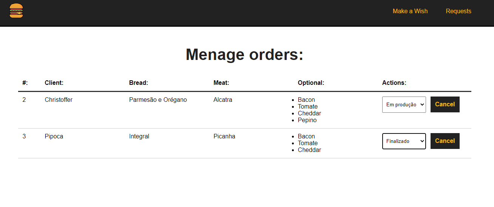

## MAKE YOUR BURGER


## Home Page: 


## Requests Page:


## Project setup
```
npm install
```

### Compiles and hot-reloads for development
```
npm run serve
```

### Customize configuration
See [Configuration Reference](https://cli.vuejs.org/config/).
