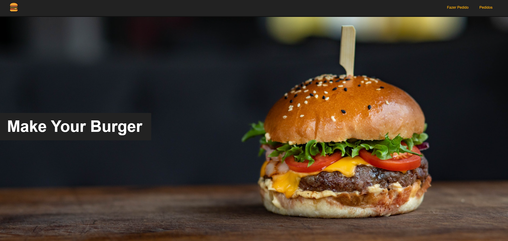

# MAKE YOUR BURGER

<p align="center">

</p>

<p>Home Page</p>


## Project setup
```
npm install
```

### Compiles and hot-reloads for development
```
npm run serve
```

### Customize configuration
See [Configuration Reference](https://cli.vuejs.org/config/).
